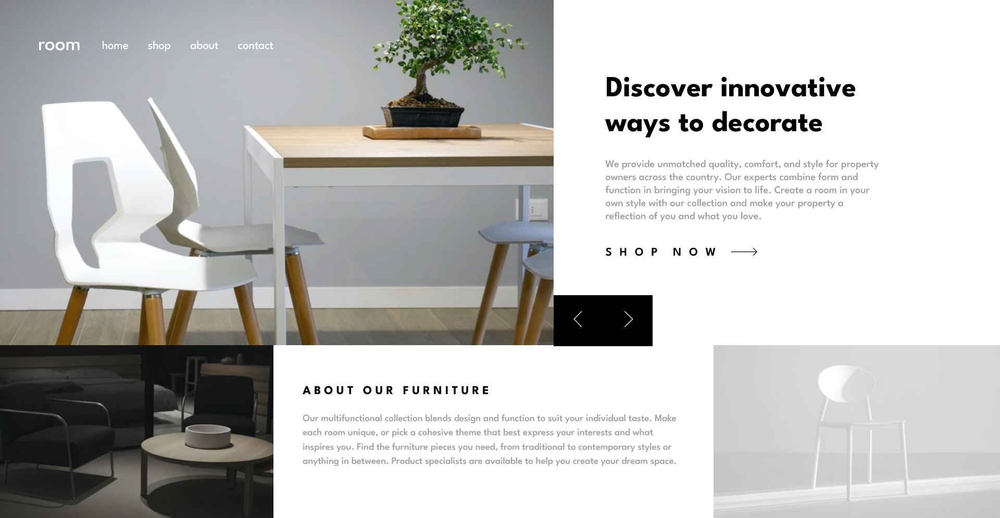

# Frontend Mentor - Room homepage solution

This is a solution to the [Room homepage challenge on Frontend Mentor](https://www.frontendmentor.io/challenges/room-homepage-BtdBY_ENq). Frontend Mentor challenges help you improve your coding skills by building realistic projects.

## Table of contents

- [Overview](#overview)
  - [The challenge](#the-challenge)
  - [Screenshot](#screenshot)
  - [Links](#links)
  - [Built with](#built-with)
- [Author](#author)

## Overview

This project is Room Homepage, made with HTML markup language, CSS style properties and JavaScript to create a interactive page, you can pass the slides with the both previous and next buttons, that will change the image and the texts, every slides have one,with a simple animation for both. The project is responsive for all the devices.

### The challenge

Users should be able to:

- View the optimal layout for the site depending on their device's screen size
- See hover states for all interactive elements on the page
- Navigate the slider using either their mouse/trackpad or keyboard

### Screenshot

### Links

- Solution URL: [Solution URL]()
- Live Site URL: [Live site URL]()

### Built with

- Semantic HTML5 markup
- CSS custom properties
- Flexbox
- JavaScript interactive properties
- Sass CSS

## Author

- Frontend Mentor - [@maria202costa](https://www.frontendmentor.io/profile/maria202costa)
